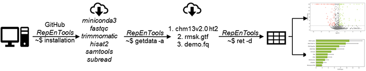

# RepEnTools

## 0. What is RepEnTools?

RepEnTools is a software package for genome-wide repeat element (RE) enrichment analysis in ChIP-seq data or similar. It is very easily accessible, with fully automated installation and analysis workflows. It can be run on commodity hardware, even by first-time UNIX users. RepEnTools provide rapid, efficient, and accurate analyses by leveraging new tools, meticulously validated settings and key functions (publication(LINK)). 

With RepEnTools you can find reproducible RE enrichments & depletions in ChIP-seq data from human samples. All you need are:
- FASTQ files from two replicates of the pull-down and their inputs, 
- internet access, 
- admin rights to a PC with a UNIX OS (recommended CPU: 4 cores @ 2.5 GHz, 16 GB RAM, 50 GB free on a HDD). If thats not an option, check our implementation (https://doi.org/10.6084/m9.figshare.24248944.v1) for Galaxy servers (e.g. usegalaxy.eu).

<picture>
    
</picture>


RepEnTools uses our custom-made bash scripts to retrieve and auto-install publically available bioinformatics software (`setup`, `installation`), download human reference files (`getdata`) and perform the RepEnTools analyses (`ret`). Within the latter, table operations, plot generation and some other tasks are performed by our custom-made Python scripts `compute_enrichment` and `plot_enrichment`.

## 1. Auto-installing RepEnTools

<picture>
    
</picture>

To analyse data, RepEnTools require several programmes (`fastqc`, `trimmomatic`, `hisat2`, `samtools`, `subread`, `python3.11` environment with dependencies). These can be retrieved and installed automatically by RepEnTools. Simply  
- Download the GitHub repository to your preferred directory and extract the files

- Right-click on the directory, open in terminal and run the setup command 

```
bash setup
```
-  Execute settings in the current shell by running
```
source ~/.bashrc
```  

- Run a script to install required tools (uses `conda` for package and environment management)

```
installation
``` 
Installation was tested on freshly installed Ubuntu 23.04 and Debian 12.2.

## 2. Downloading necessary data

To analyse data, RepEnTools also need the human chm13v2.0 genome indexes (HFM) for hisat2 (ht2 files) and our adjusted repeat masker (RMSK) gtf file. These are downloaded from the RepEnTools repository on figshare (~ 5.5 GB extracted size). We also provide a demo ChIP-seq data set (200k reads) to test the installation and running of RepEnTools. 

Make sure you have an active internet connection. Download all datasets (3) in the current working directory. This directory is now RepEnTools' reference directory for the ht2 and gtf files.  
```
getdata -a
```  

Alternatively, you can download only the hisat2 genome indexes to your choice of directory. If you later wish to change RepEnTools' reference directories for the files see Troubleshooting.
```
getdata -i /path/to/save/genome_indexes
``` 
To download only the repeat masker file
```
getdata -g /path/to/save/gtf_file
``` 
To download only the demo ChIP-seq data
```
getdata -r /path/to/save/ret_demo_data
``` 

Print the help message
```
getdata -h
```
Runtime for RepEnTools installation < 8 min; index retrieval < 7 min; demo RepEnTools < 4 min. Testing was conducted on a 64-bit, Intel i5-6500 @ 3.2 GHz x4 (2015), 16 GB RAM, 1TB HDD desktop running fresh Ubuntu 23.04 or Debian 12.2.

## 3. Analysing data with RepEnTools (demo & basic mode)

Now, you can run RepEnTools using our demo data or analyse your own.

### Demo mode

The easiest way to use RepEnTools is to create a folder named chm13v2, right click -> open in terminal, and download the ht2 and gtf files using 
```
getdata -a
``` 
Then, create a folder named Demo, open in terminal and run the demo mode
```
ret -d
```  
You can find the results of the analysis a few minutes later in the Demo folder. You should have 1 .summary, 4 .csv, and 2 .jpg files, as well as other files. You can compare these to the reference Demo data.

### Analysing your own ChIP-seq data (basic)
•	Before an analysis

  Make sure you have the ht2 and gtf files. Save your fq.gz files in one folder and rename them according to the scheme:  
  Rep1_input_R1.fq.gz  
  Rep1_input_R2.fq.gz  
  Rep2_input_R1.fq.gz  
  Rep2_input_R2.fq.gz  
  Rep1_ChIP_R1.fq.gz  
  Rep1_ChIP_R2.fq.gz  
  Rep2_ChIP_R1.fq.gz  
  Rep2_ChIP_R2.fq.gz  

•	Running an analysis (basic)

Open the folder with your files in terminal and run
```
ret -s ./
```  
Running RepEnTools with a full dataset on commodity hardware, analysis should complete in under 2h. If you need to change RepEnTools' reference directory for the files see Troubleshooting. 

## 4. Analysing data with RepEnTools (advanced & expert)

### Advanced analysis

RepEnTools uses additional flags to deviate from default settings. For optimal performance first identify your machine's specs. You can adjust the `-p` flag to get your results faster. We recommend using the `-l` flag for optimal data quality. Runtime for RepEnTools analysis of a full dataset (UHRF1-TTD CIDOP: GSE213741) was consistently < 105 min, using -l "590;400;450;390" -p 4 on the testing machine.

The command syntax is
```
ret -s /path/to/samples -l "INT;INT;INT;INT" -g /path/to/rmsk.gtf -n /path/to/hisat2/indexes -p INT 
```  

Usage:  ret -s STR -l "INT;INT;INT;INT" -g STR -n STR -p INT [-d] [-h]  
  INT: integer; STR: string  
 
 Command | Description
 :--- | :--- 
  `-s` |input /path/to/samples  
  `-l` |"Max insert sizes (see paper(LINK))"  # default: "500;500;500;500" Library sizes in the following order: Rep1_input Rep2_input Rep1_ChIP Rep2_ChIP # e.g. "590;400;450;390" for UHRF1-TTD CIDOP    
  `-g` |/path/to/rmsk.gtf  # If it is not added to ENVIRONMENT VARIABLES  
  `-n` |/path/to/hisat2/indexes # If it is not added to ENVIRONMENT VARIABLES  
  `-p` |INT; number of processors to use, default: 2 # e.g. 4   
  `-d` |Runs analysis with the demo data. To get data run command: getdata  
  `-h` |Print the help message  
  
### Expert analysis

As an expert user, you can use RepEnTools without the automated workflows. Specifically, RepEnTools lets you specify the input and the output of the python scripts.

First, produce files similar to the flagstat and featurecounts reports and summaries of RepEnTools. The latter are then aggregated into one file per type. 

Then run
```
conda activate py3.11
compute_enrichment.py -r STR -s STR (-g | -f STR) -c STR -t STR -e STR
plot_enrichment.py -r STR -v STR -f STR -b STR
```  

Arguments for `compute_enrichment.py`
Command | Description
 :--- | :---   
  `-r` |input /path/to/featurecounts_aggregated_report_file.txt  
  `-s` |input /path/to/featurecounts_aggregated_summary_file.summary
  `-g` |input gets all flagstat files in the working directory  
  `-f` |alternative input /path/to/flagstat_aggregated_report_file  
  `-c` |output complete_report_file-name.csv  
  `-t` |output filtered_report_file-name.csv   
  `-e` |output experiment_summary_file-name.csv  
  `-h` |Print the help message  

The aggregate report file is often challenging for office PCs and is therefore deleted at the end of `ret`. To demonstrate the filename and structure of the tabular file (rmsk_multiple_feature_counts.txt), we provide a minimal exemplary file. 

Arguments for `plot_enrichment.py`
Command | Description
 :--- | :---  
  `-r` |input /path/to/RepEnTools_report_file.csv  
  `-v` |output volcano_plot_file-name.jpg | .png  
  `-f` |output families_statistics_file-name.csv   
  `-b` |output bar_plot_file-name.jpg only  
  `-h` |Print the help message  


## 5. How RepEnTools analysis works

RepEnTools uses FASTQ files from two replicates of chromatin pulldown experiments and their respective input chromatin to produce enrichment tables and plots. The reads are trimmed (trimmomatic), mapped (hisat2) and the ones overlapping the RMSK annotation are counted and grouped by RE subfamily (subread-featurecounts). These tasks are performed by the bash script `ret`, which regulates the conda environments, the bioinformatics packages that RepEnTools uses, the Python scripts written specifically for RepEnTools, and all subsequent steps.

<picture>
    
</picture>

Next, RepEnTools activates our Python scripts to process the data, leveraging five packages (see python_requirements.txt). 

First, `compute_enrichment.py` normalises the read-counts to the size of the corresponding library using pseudocounts for zero reads, and calculates enrichment as ChIP over input. Then, from the two replicates, we calculate averages, the Z-score and corresponding p-value to determine enrichment and depletion statistics (see paper(LINK)), as well as FDR (BH-adjusted p-values) for the 15744 REs used in the volcano plot. The processing is saved in the temporary rmsk_multiple_feature_counts.txt. Finally, it generates the files  
- ret_experiment_summary.csv, which shows the fraction of ChIP or Input reads on rmsk and the rmsk-wide enrichment of ChIP/Input
- the ret_report.csv, which contains all the data
- the ret_report_ChIP.csv, which is filtered to only contain the well-reproducible, well-defined, and annotated families of REs (i.e. without Simple_repeat, Low_complexity, tRNA, Unknown). For more details read the FAQ.md and our paper (LINK).  

  


Then, `plot_enrichment.py` reads the output to generate the volcano plot, as well as group and recalculate the data by family, and generate the bar diagram. Once the scripts are completed, `ret` deletes the temporary tabular txt file.

Your analysis with RepEnTools is now complete, and you should check the FASTQC and flagstat files to verify that your data are of good quality, with a high percentage of mapped reads. To get an overview of your results, RepEnTools produce a summary csv and plots to orient yourself. Then, more detailed results are found in the easy to read and re-use csv files.   

## 6. Troubleshooting

- If the path to RepEnTools' default reference directories needs adjustment, then run nano ~/.bashrc, scroll to the end of the text, adjust the directory names, save by pressing ctrl+X,Y, and run $ source ~/.bashrc.

- If you get the error "Permission denied", then run the setup and source commands.

## Contributions
- MC designed the RepEnTools analysis and the pipeline
- PB designed the UNIX implementation and wrote all the scripts